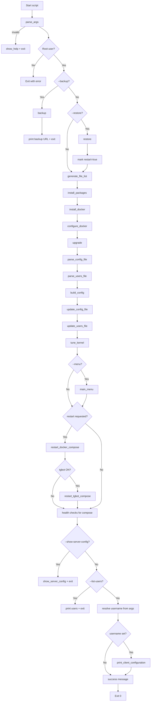
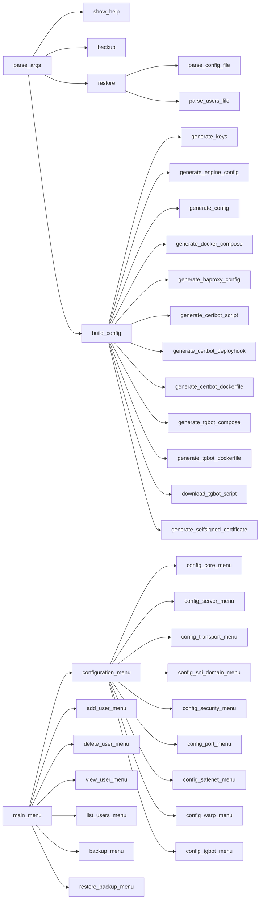
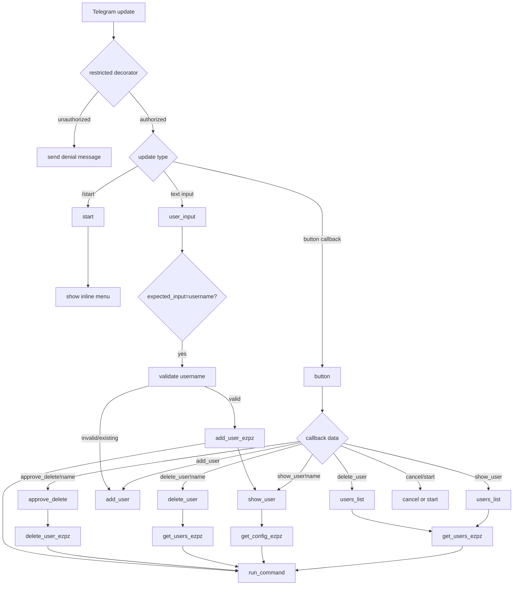

# Reality-EZPZ Code Review & Program Flow

## Repository overview

This repository contains two executable entry points:

1. `reality-ezpz.sh` — the main installer/configurator/manager script.
2. `tgbot.py` — an optional Telegram bot for user management.

At runtime, the shell script is responsible for host setup, config generation, Docker orchestration, and user lifecycle actions. The Telegram bot is a remote control layer that invokes the shell script commands.

---

## What `reality-ezpz.sh` does when run

### 1) Parse CLI and validate inputs

Execution starts by parsing CLI options with `parse_args`, validating transport/security/domain/server/port/bot values and setting operation flags (`--backup`, `--restore`, `--restart`, `--menu`, user actions, etc.).

### 2) Enforce root and pre-flight operations

The script requires root privileges (`EUID == 0`).

If backup/restore flags are supplied, it executes those flows first:
- `backup`: package state and upload to temp.sh.
- `restore`: download/read backup and restore config/users.

### 3) Install/upgrade/setup foundations

Normal run path performs:
- `generate_file_list`
- `install_packages`
- `install_docker`
- `configure_docker`
- `upgrade`
- `parse_config_file`
- `parse_users_file`
- `build_config`
- `update_config_file`
- `update_users_file`
- `tune_kernel`

### 4) Interactive and service orchestration

If menu mode is enabled (`--menu`), `main_menu` is launched (dialog-based TUI).

Then service lifecycle logic ensures the core compose stack is running and, when enabled, the Telegram bot compose stack is also running:
- `restart_docker_compose`
- `restart_tgbot_compose` (conditional)

### 5) Output-oriented user actions

Finally it handles output actions:
- `--show-server-config` → `show_server_config`
- `--list-users` → print users
- `--show-user`, `--add-user` → resolve username and call `print_client_configuration`

If no hard error occurs, it prints `Command has been executed successfully!`.

---

## Program flow chart (main shell script)

---

## Function interconnection chart

### `reality-ezpz.sh` (high-level)

### `tgbot.py` (event/callback flow)

---

## Code review

## Strengths

- Clear operational phases in the shell script: parse, bootstrap, build, persist, orchestrate, output.
- Extensive input validation in `parse_args` and regex guards for common fields.
- Useful recovery/portability features: backup/restore, defaults restoration, menu-based management.
- Telegram bot uses a clean `restricted` decorator for authorization and keeps handlers concise.

## Risks / Improvement opportunities

1. **Remote execution pattern in bot**
   - `tgbot.py` executes a shell command that fetches a remote script URL at runtime (`bash <(curl -sL ...)`).
   - Even with username validation, runtime remote fetch introduces supply-chain and availability risk.
   - Recommendation: execute a pinned local script path instead and update by explicit deployment.

2. **Potential command injection surface (defense-in-depth)**
   - Bot command construction uses string concatenation and `bash -c` in `run_command`.
   - Current username regex blocks special characters, but safer design is `subprocess.run([...], shell=False)` with argument vectors.

3. **Error propagation in bot subprocess wrapper**
   - `run_command` discards stderr and return code, so handlers may present success even if command failed.
   - Recommendation: check return code and surface stderr to logs/user-safe error messages.

4. **Large monolithic shell script**
   - The shell script is feature-rich but long and dense; maintenance/testing burden is high.
   - Recommendation: split into sourced modules (args, renderers, docker, warp, ui, backup) while keeping one entrypoint.

5. **`set -e` + command substitution subtleties**
   - In large bash scripts, `set -e` can behave unexpectedly inside conditionals/subshells; this may create edge-case continuation paths.
   - Recommendation: add explicit `|| return/exit` for critical external calls and more targeted failure handling.

## Suggested next hardening steps (priority)

1. Replace bot remote-exec command with local script execution.
2. Refactor bot subprocess calls to argument arrays and explicit error handling.
3. Add basic automated checks (shellcheck, bashate or shfmt check, Python lint/type checks).
4. Add smoke tests for high-value flags (`--list-users`, `--add-user`, `--show-user`, `--backup`, `--restore`).

